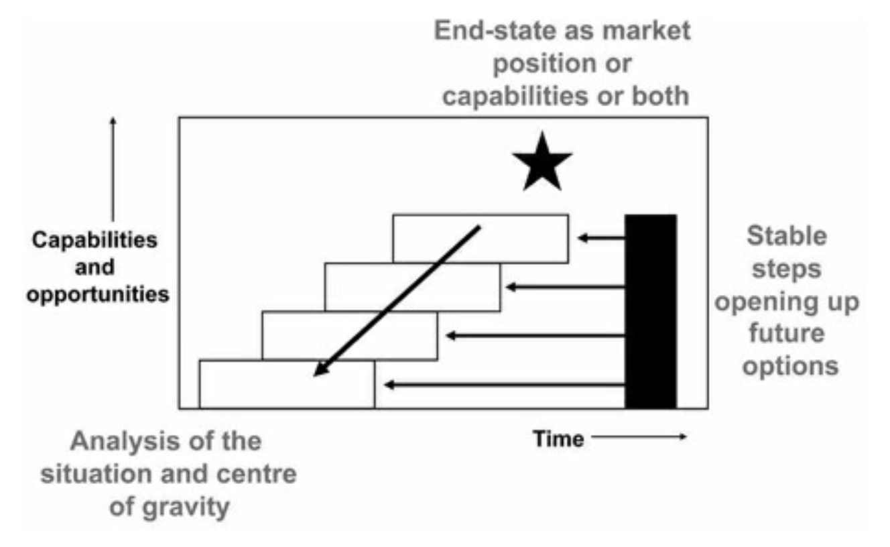
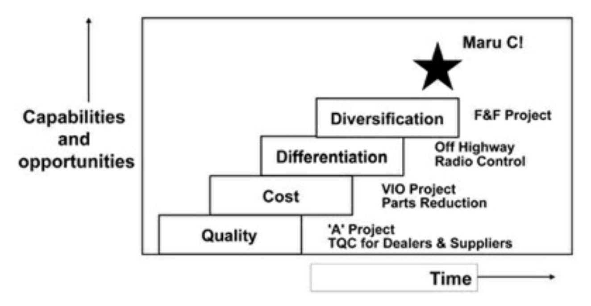
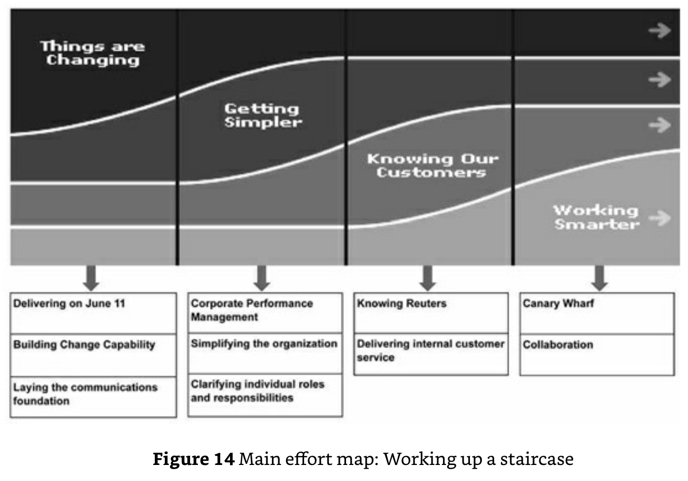

Friction creates a knowledge gap. The strategic staircase (including the "main effort" concept that is integral to it) is one method to close the knowledge gap, which is to say, to make plans that will deliver the outcome we hope for. It's a way to derive a "next step" from a long-term end-state.

We figure out what steps will take us to the end-state. Each step becomes a "main effort", a priority. There's always going to be a lot of things going on at any time that aren't the main effort. But it's the main effort that has the first claim on resources, gets the best people (or effort), and is the main yardstick of success.

In a way, the strategic staircase and "main effort", is a method, like a Personal Kanban - Jim Benson & Tonianne DeMaria Barry (2011 book), to Embrace limits and constraints.

---

## Reference
Bungay, Stephen. "The Art of Action" (2011), *Quercus*

> 
> 

> The steps of a staircase are not to-do lists but sets of tasks related to each other as elements of a whole. Not all tasks are equal. At each level, one task is defined as the “main effort.” The steps of the staircase define the company’s main effort every year (in Komatsu, the “President’s theme”) at the strategic level. There was a lot going on in the first year apart from quality. But the quality effort had first claim on resources, got the best people, and was the main yardstick of success. “Main effort” is the one thing that has to succeed, either because it in itself will have a greater effect than anything else or because other things depend on it. If resources become scarce, it is the last thing to be cut. If more become available, it is where they will go. If problems arise there, other things are left alone if necessary in order to fix them.

> 