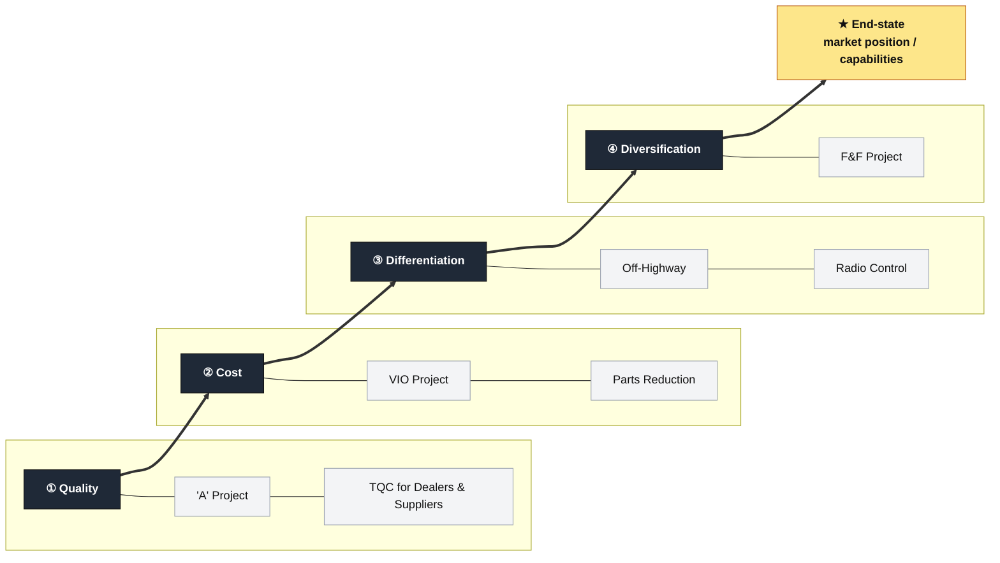
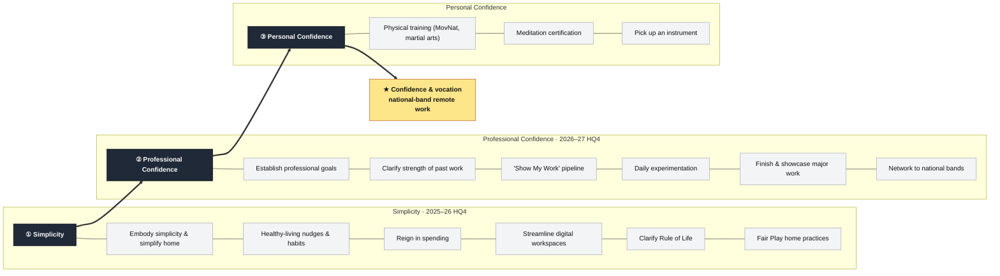

# Strategic Staircase — Visual Template

A reusable recreation of Bungay's strategic staircase / "main effort" diagram. Each **step** is a *main effort* that has first claim on resources; the steps rise over time toward an **end-state** (★). Beneath each step sits a **column of sub-parts** — the concrete projects/tasks that make up that stage (the "Figure 14 main-effort map" form).

Two interchangeable builds are below:
- **Build A — HTML/CSS** (renders in Obsidian *Reading view*): closest to the original, columns of parts along the bottom. Edit by hand.
- **Build B — Mermaid**: lighter to edit, renders in both Live Preview and Reading view, but no rising-stair offset.

> [!tip] How to change parameters
> Each step is one self-contained block. To **add a step**, copy a `<!-- STEP -->` block and bump the `margin-bottom` (the *rise*) so it sits higher than the one before. To **change the parts**, edit the `PART` lines under that step. To change the **goal**, edit the ★ block.

---

## Build A — HTML/CSS staircase

  <!-- ★ END-STATE / GOAL (top-right) -->
  

    
★

    
End-state market position &amp; capabilities

  

  <!-- Y-AXIS LABEL -->
  

    ↑ Capabilities &amp; opportunities
  

  <!-- STAIRCASE ROW -->
  

    <!-- STEP 1 (rise = 0) -->
    

      
① Quality

      

      

        <!-- PART -->
'A' Project

        <!-- PART -->
TQC for Dealers &amp; Suppliers

      

    

    <!-- STEP 2 (rise = 70) -->
    

      
② Cost

      

      

        <!-- PART -->
VIO Project

        <!-- PART -->
Parts Reduction

      

    

    <!-- STEP 3 (rise = 140) -->
    

      
③ Differentiation

      

      

        <!-- PART -->
Off-Highway

        <!-- PART -->
Radio Control

      

    

    <!-- STEP 4 (rise = 210) -->
    

      
④ Diversification

      

      

        <!-- PART -->
F&amp;F Project

      

    

  

  <!-- X-AXIS LABEL -->
  
Time →

### Example 2 — Bryan's strategy (from `STRATEGY.md`)

  

    
★

    
Confidence &amp; vocation national-band remote work

  

  

    ↑ Capabilities &amp; opportunities
  

  

    <!-- STEP 1 (rise = 0) -->
    

      
① Simplicity 2025–2026 HQ4

      

      

        
Embody simplicity · simplify home

        
Healthy-living nudges &amp; habits

        
Reign in spending

        
Streamline digital workspaces

        
Clarify Rule of Life

        
Fair Play home practices

      

    

    <!-- STEP 2 (rise = 90) -->
    

      
② Professional Confidence 2026 HQ4 – 2027 HQ4

      

      

        
Establish professional goals

        
Clarify strength of past work

        
"Show My Work" pipeline

        
Daily experimentation

        
Finish &amp; showcase major work

        
Network → national bands

      

    

    <!-- STEP 3 (rise = 180) -->
    

      
③ Personal Confidence

      

      

        
Physical training (MovNat, martial arts)

        
Meditation certification

        
Pick up an instrument

      

    

  

  
Time →

---

## Build B — Mermaid staircase

> Edit the labels in the `subgraph` titles (main efforts), the part nodes (`Pxx`), and the final `GOAL`. Reorder by changing the `E1 ==> E2 ==> …` chain.

### Example 2 — Bryan's strategy (from `STRATEGY.md`)

---

## Build C — Connected staircase (Komatsu form)

*Riffs on `Bungay_StrategicStaircase_2.png` — tight, overlapping steps climbing to the ★, with sub-projects labeled beside each. Inline SVG: edit the `<text>` labels and the `y` of each block to re-grade the climb.*

<svg viewBox="0 0 720 430" xmlns="http://www.w3.org/2000/svg" role="img" style="max-width:100%;height:auto;font-family:sans-serif;">
  <title>Connected strategic staircase</title>
  <!-- axes -->
  <line x1="40" y1="380" x2="40" y2="50" stroke="#475569" stroke-width="2" marker-end="url(#ah)"/>
  <line x1="40" y1="380" x2="690" y2="380" stroke="#475569" stroke-width="2" marker-end="url(#ah)"/>
  <defs>
    <marker id="ah" markerWidth="10" markerHeight="10" refX="6" refY="3" orient="auto"><path d="M0,0 L6,3 L0,6 Z" fill="#475569"/></marker>
    <marker id="ahl" markerWidth="12" markerHeight="12" refX="7" refY="4" orient="auto"><path d="M0,0 L8,4 L0,8 Z" fill="#1f2937"/></marker>
  </defs>
  <text x="20" y="215" transform="rotate(-90 20,215)" text-anchor="middle" font-size="13" font-weight="700" fill="#475569">Capabilities &amp; opportunities</text>
  <text x="360" y="408" text-anchor="middle" font-size="13" font-weight="700" fill="#475569">Time →</text>
  <!-- steps -->
  <g font-size="14" font-weight="700" fill="#ffffff" text-anchor="middle">
    <rect x="60"  y="300" width="160" height="46" rx="5" fill="#1f2937"/><text x="140" y="328">① Quality</text>
    <rect x="190" y="248" width="160" height="46" rx="5" fill="#1f2937"/><text x="270" y="276">② Cost</text>
    <rect x="320" y="196" width="160" height="46" rx="5" fill="#1f2937"/><text x="400" y="224">③ Differentiation</text>
    <rect x="450" y="144" width="160" height="46" rx="5" fill="#1f2937"/><text x="530" y="172">④ Diversification</text>
  </g>
  <!-- sub-parts beside each step -->
  <g font-size="11" fill="#334155" text-anchor="start">
    <text x="226" y="332">'A' Project · TQC for Dealers &amp; Suppliers</text>
    <text x="356" y="280">VIO Project · Parts Reduction</text>
    <text x="486" y="228">Off-Highway · Radio Control</text>
    <text x="616" y="176">F&amp;F Project</text>
  </g>
  <!-- goal -->
  <text x="640" y="95" font-size="34" fill="#b45309" text-anchor="middle">★</text>
  <text x="640" y="118" font-size="12" font-weight="700" fill="#475569" text-anchor="middle">Maru C!</text>
</svg>

### Example 2 — Bryan's strategy (from `STRATEGY.md`)

<svg viewBox="0 0 720 430" xmlns="http://www.w3.org/2000/svg" role="img" style="max-width:100%;height:auto;font-family:sans-serif;">
  <title>Bryan's connected strategic staircase</title>
  <line x1="40" y1="380" x2="40" y2="50" stroke="#475569" stroke-width="2" marker-end="url(#ahb)"/>
  <line x1="40" y1="380" x2="690" y2="380" stroke="#475569" stroke-width="2" marker-end="url(#ahb)"/>
  <defs><marker id="ahb" markerWidth="10" markerHeight="10" refX="6" refY="3" orient="auto"><path d="M0,0 L6,3 L0,6 Z" fill="#475569"/></marker></defs>
  <text x="20" y="215" transform="rotate(-90 20,215)" text-anchor="middle" font-size="13" font-weight="700" fill="#475569">Capabilities &amp; opportunities</text>
  <text x="360" y="408" text-anchor="middle" font-size="13" font-weight="700" fill="#475569">Time →</text>
  <g font-size="14" font-weight="700" fill="#ffffff" text-anchor="middle">
    <rect x="60"  y="300" width="180" height="46" rx="5" fill="#1f2937"/><text x="150" y="322">① Simplicity</text><text x="150" y="338" font-size="10" font-weight="400">2025–26 HQ4</text>
    <rect x="240" y="240" width="200" height="46" rx="5" fill="#1f2937"/><text x="340" y="262">② Professional Confidence</text><text x="340" y="278" font-size="10" font-weight="400">2026–27 HQ4</text>
    <rect x="440" y="180" width="200" height="46" rx="5" fill="#1f2937"/><text x="540" y="208">③ Personal Confidence</text>
  </g>
  <g font-size="10.5" fill="#334155" text-anchor="start">
    <text x="246" y="324">Simplify home · spending · Rule of Life</text>
    <text x="446" y="264">Show My Work · showcase · national bands</text>
    <text x="540" y="244" text-anchor="middle">Training · meditation · instrument</text>
  </g>
  <text x="630" y="120" font-size="34" fill="#b45309" text-anchor="middle">★</text>
  <text x="630" y="143" font-size="11" font-weight="700" fill="#475569" text-anchor="middle">Confidence &amp; vocation</text>
</svg>

---

## Build D — Flowing main-effort map (Figure 14 form)

*Riffs on `Bungay_StrategicStaircase_3.png` — stage ribbons rising left-to-right, each fed by a column of concrete deliverables below. Edit the band `<text>` and the four columns of part boxes.*

<svg viewBox="0 0 760 440" xmlns="http://www.w3.org/2000/svg" role="img" style="max-width:100%;height:auto;font-family:sans-serif;">
  <title>Flowing main-effort map</title>
  <!-- rising ribbons (graded) -->
  <polygon points="20,300 200,300 200,250 20,270" fill="#475569"/>
  <polygon points="200,250 380,250 380,200 200,250" fill="#64748b"/>
  <polygon points="200,250 380,250 380,200 200,200" fill="#64748b"/>
  <polygon points="380,200 560,200 560,150 380,200" fill="#94a3b8"/>
  <polygon points="380,200 560,200 560,150 380,150" fill="#94a3b8"/>
  <polygon points="560,150 740,150 740,100 560,150" fill="#cbd5e1"/>
  <polygon points="560,150 740,150 740,100 560,100" fill="#cbd5e1"/>
  <g font-size="14" font-weight="700" text-anchor="middle">
    <text x="110" y="288" fill="#ffffff">Things are Changing</text>
    <text x="290" y="232" fill="#ffffff">Getting Simpler</text>
    <text x="470" y="182" fill="#1f2937">Knowing Our Customers</text>
    <text x="650" y="132" fill="#1f2937">Working Smarter →</text>
  </g>
  <!-- connectors down to part columns -->
  <g stroke="#94a3b8" stroke-width="1.5" marker-end="url(#ahu)">
    <line x1="110" y1="360" x2="110" y2="312"/>
    <line x1="290" y1="360" x2="290" y2="262"/>
    <line x1="470" y1="360" x2="470" y2="212"/>
    <line x1="650" y1="360" x2="650" y2="162"/>
  </g>
  <defs><marker id="ahu" markerWidth="10" markerHeight="10" refX="3" refY="1" orient="auto"><path d="M0,6 L3,0 L6,6 Z" fill="#94a3b8"/></marker></defs>
  <!-- part columns -->
  <g font-size="10.5" fill="#1f2937" text-anchor="middle">
    <rect x="25"  y="362" width="170" height="62" rx="4" fill="#f1f5f9" stroke="#cbd5e1"/>
    <text x="110" y="380">Delivering on June 11</text><text x="110" y="397">Building change capability</text><text x="110" y="414">Laying comms foundation</text>
    <rect x="205" y="362" width="170" height="62" rx="4" fill="#f1f5f9" stroke="#cbd5e1"/>
    <text x="290" y="380">Corporate Perf. Mgmt</text><text x="290" y="397">Simplifying the org</text><text x="290" y="414">Clarifying roles</text>
    <rect x="385" y="362" width="170" height="62" rx="4" fill="#f1f5f9" stroke="#cbd5e1"/>
    <text x="470" y="385">Knowing Reuters</text><text x="470" y="405">Internal customer service</text>
    <rect x="565" y="362" width="170" height="62" rx="4" fill="#f1f5f9" stroke="#cbd5e1"/>
    <text x="650" y="385">Canary Wharf</text><text x="650" y="405">Collaboration</text>
  </g>
</svg>

### Example 2 — Bryan's strategy (from `STRATEGY.md`)

<svg viewBox="0 0 760 440" xmlns="http://www.w3.org/2000/svg" role="img" style="max-width:100%;height:auto;font-family:sans-serif;">
  <title>Bryan's flowing main-effort map</title>
  <polygon points="20,300 260,300 260,250 20,275" fill="#475569"/>
  <polygon points="260,250 500,250 500,195 260,195" fill="#94a3b8"/>
  <polygon points="500,195 740,195 740,135 500,135" fill="#cbd5e1"/>
  <g font-size="15" font-weight="700" text-anchor="middle">
    <text x="140" y="282" fill="#ffffff">① Simplicity</text>
    <text x="380" y="227" fill="#1f2937">② Professional Confidence</text>
    <text x="620" y="172" fill="#1f2937">③ Personal Confidence →</text>
  </g>
  <g stroke="#94a3b8" stroke-width="1.5" marker-end="url(#ahub)">
    <line x1="140" y1="360" x2="140" y2="305"/>
    <line x1="380" y1="360" x2="380" y2="255"/>
    <line x1="620" y1="360" x2="620" y2="200"/>
  </g>
  <defs><marker id="ahub" markerWidth="10" markerHeight="10" refX="3" refY="1" orient="auto"><path d="M0,6 L3,0 L6,6 Z" fill="#94a3b8"/></marker></defs>
  <g font-size="10.5" fill="#1f2937" text-anchor="middle">
    <rect x="30"  y="362" width="220" height="70" rx="4" fill="#f1f5f9" stroke="#cbd5e1"/>
    <text x="140" y="378">Embody simplicity · simplify home</text><text x="140" y="394">Habits · reign in spending</text><text x="140" y="410">Streamline digital · Rule of Life</text><text x="140" y="426">Fair Play home practices</text>
    <rect x="270" y="362" width="220" height="70" rx="4" fill="#f1f5f9" stroke="#cbd5e1"/>
    <text x="380" y="378">Professional goals · audit past work</text><text x="380" y="394">"Show My Work" pipeline</text><text x="380" y="410">Daily experimentation</text><text x="380" y="426">Showcase work · network to bands</text>
    <rect x="510" y="362" width="220" height="70" rx="4" fill="#f1f5f9" stroke="#cbd5e1"/>
    <text x="620" y="386">Physical training (MovNat, martial arts)</text><text x="620" y="404">Meditation certification</text><text x="620" y="422">Pick up an instrument</text>
  </g>
</svg>

---

## Build E — Conceptual thrust diagram (the "abstract" form)

*Riffs on `Bungay_StrategicStaircase_1.png` — the textbook version: the ★ end-state, the diagonal "thrust line," and the vertical bar of stable steps "opening up future options." Edit corner captions and step `y` values.*

<svg viewBox="0 0 700 430" xmlns="http://www.w3.org/2000/svg" role="img" style="max-width:100%;height:auto;font-family:sans-serif;">
  <title>Conceptual strategic staircase</title>
  <defs>
    <marker id="t-end" markerWidth="12" markerHeight="12" refX="7" refY="4" orient="auto"><path d="M0,0 L8,4 L0,8 Z" fill="#1f2937"/></marker>
    <marker id="t-back" markerWidth="11" markerHeight="11" refX="6" refY="3.5" orient="auto"><path d="M7,0 L0,3.5 L7,7 Z" fill="#475569"/></marker>
    <marker id="t-axis" markerWidth="10" markerHeight="10" refX="6" refY="3" orient="auto"><path d="M0,0 L6,3 L0,6 Z" fill="#475569"/></marker>
  </defs>
  <!-- frame -->
  <rect x="120" y="60" width="450" height="300" fill="none" stroke="#334155" stroke-width="2"/>
  <!-- axes -->
  <line x1="100" y1="370" x2="100" y2="55" stroke="#475569" stroke-width="2" marker-end="url(#t-axis)"/>
  <text x="80" y="215" transform="rotate(-90 80,215)" text-anchor="middle" font-size="13" font-weight="700" fill="#475569">Capabilities &amp; opportunities</text>
  <text x="345" y="395" text-anchor="middle" font-size="13" font-weight="700" fill="#475569">Time →</text>
  <!-- end-state -->
  <text x="350" y="105" font-size="32" fill="#b45309" text-anchor="middle">★</text>
  <text x="350" y="48" font-size="12" font-weight="700" fill="#475569" text-anchor="middle">End-state: market position and/or capabilities</text>
  <!-- stepped blocks -->
  <g fill="#ffffff" stroke="#1f2937" stroke-width="2">
    <rect x="150" y="290" width="120" height="40"/>
    <rect x="215" y="250" width="120" height="40"/>
    <rect x="280" y="210" width="120" height="40"/>
    <rect x="345" y="170" width="120" height="40"/>
  </g>
  <!-- thrust line -->
  <line x1="430" y1="180" x2="175" y2="320" stroke="#1f2937" stroke-width="3" marker-end="url(#t-end)"/>
  <!-- stable-steps bar + back arrows -->
  <rect x="505" y="170" width="18" height="160" fill="#1f2937"/>
  <g stroke="#475569" stroke-width="1.5" marker-end="url(#t-back)">
    <line x1="503" y1="190" x2="465" y2="190"/>
    <line x1="503" y1="230" x2="400" y2="230"/>
    <line x1="503" y1="270" x2="335" y2="270"/>
    <line x1="503" y1="310" x2="270" y2="310"/>
  </g>
  <!-- captions -->
  <text x="150" y="350" font-size="11" fill="#334155">Analysis of the situation &amp; centre of gravity</text>
  <text x="585" y="240" font-size="11" fill="#334155" text-anchor="middle"><tspan x="585" dy="0">Stable steps</tspan><tspan x="585" dy="14">opening up</tspan><tspan x="585" dy="14">future options</tspan></text>
</svg>

### Example 2 — Bryan's strategy (from `STRATEGY.md`)

<svg viewBox="0 0 700 430" xmlns="http://www.w3.org/2000/svg" role="img" style="max-width:100%;height:auto;font-family:sans-serif;">
  <title>Bryan's conceptual strategic staircase</title>
  <defs>
    <marker id="te2" markerWidth="12" markerHeight="12" refX="7" refY="4" orient="auto"><path d="M0,0 L8,4 L0,8 Z" fill="#1f2937"/></marker>
    <marker id="tb2" markerWidth="11" markerHeight="11" refX="6" refY="3.5" orient="auto"><path d="M7,0 L0,3.5 L7,7 Z" fill="#475569"/></marker>
    <marker id="ta2" markerWidth="10" markerHeight="10" refX="6" refY="3" orient="auto"><path d="M0,0 L6,3 L0,6 Z" fill="#475569"/></marker>
  </defs>
  <rect x="120" y="60" width="450" height="300" fill="none" stroke="#334155" stroke-width="2"/>
  <line x1="100" y1="370" x2="100" y2="55" stroke="#475569" stroke-width="2" marker-end="url(#ta2)"/>
  <text x="80" y="215" transform="rotate(-90 80,215)" text-anchor="middle" font-size="13" font-weight="700" fill="#475569">Capabilities &amp; opportunities</text>
  <text x="345" y="395" text-anchor="middle" font-size="13" font-weight="700" fill="#475569">Time →</text>
  <text x="350" y="105" font-size="32" fill="#b45309" text-anchor="middle">★</text>
  <text x="350" y="48" font-size="12" font-weight="700" fill="#475569" text-anchor="middle">End-state: confidence &amp; vocation</text>
  <g fill="#ffffff" stroke="#1f2937" stroke-width="2">
    <rect x="150" y="288" width="150" height="42"/>
    <rect x="255" y="232" width="150" height="42"/>
    <rect x="360" y="176" width="150" height="42"/>
  </g>
  <g font-size="12" font-weight="700" fill="#1f2937" text-anchor="middle">
    <text x="225" y="314">① Simplicity</text>
    <text x="330" y="258">② Professional</text>
    <text x="435" y="202">③ Personal</text>
  </g>
  <line x1="470" y1="186" x2="175" y2="322" stroke="#1f2937" stroke-width="3" marker-end="url(#te2)"/>
  <rect x="525" y="176" width="18" height="154" fill="#1f2937"/>
  <g stroke="#475569" stroke-width="1.5" marker-end="url(#tb2)">
    <line x1="523" y1="200" x2="510" y2="200"/>
    <line x1="523" y1="253" x2="405" y2="253"/>
    <line x1="523" y1="306" x2="300" y2="306"/>
  </g>
  <text x="150" y="350" font-size="11" fill="#334155">Diagnosis: ADHD, faith transition, financial strain</text>
  <text x="600" y="240" font-size="11" fill="#334155" text-anchor="middle"><tspan x="600" dy="0">Each phase</tspan><tspan x="600" dy="14">builds confidence</tspan><tspan x="600" dy="14">&amp; opens options</tspan></text>
</svg>

---

## Source

Bungay, Stephen. *The Art of Action* (Quercus, 2011) — Figs. of the strategic staircase and "main effort map." See Stategic staircase and The Art of Action (by Stephen Bungay) (Readwise).
